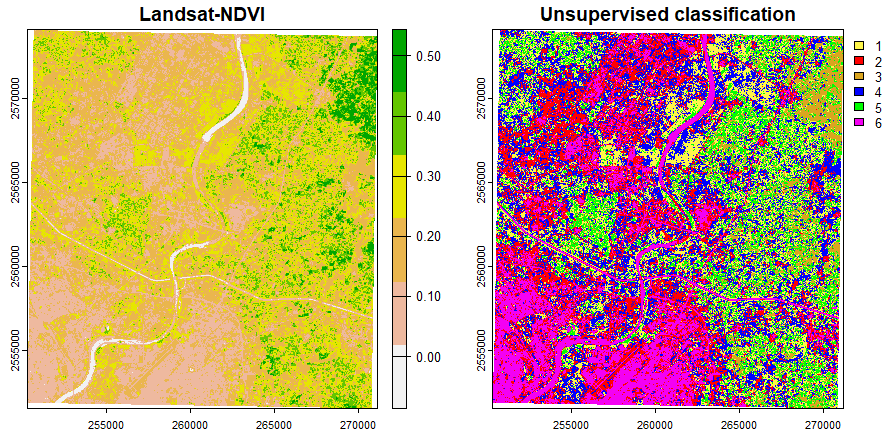

class: middle inverse

```{r setup, include=FALSE}
options(htmltools.dir.version = FALSE)
knitr::opts_chunk$set(out.width = "100%", cache = FALSE, echo = TRUE, message = FALSE, warning = FALSE, fig.show = TRUE, hiline = TRUE, results = "asis")

# Bibliography and Citation
library(RefManageR)
library(bibtex)
BibOptions(check.entries = FALSE, bib.style = "authoryear", style = "text", first.inits = FALSE)
bib <- ReadBib("./data/Bibliography.bib")
```

```{r, echo=FALSE, include=TRUE}
library(xaringanExtra)
use_logo(image_url = "./css/Anix-Logo.png", link_url = "https://www.ankitdeshmukh.com/", width = "40px", height = "40px")
use_progress_bar(color = "#25586088", location = "top", height = "0.25em")
use_xaringan_extra(c("tile_view", "tachyons", "use_logo", "use_progress_bar"))
use_extra_styles(hover_code_line = TRUE, mute_unhighlighted_code = FALSE)
```

<!-- ------------------------- Start your slides ------------------------- -->

# .f2.gold[“‘A map says to you.<br />Read me carefully, follow me closely, doubt me not ... <br />I am the earth in the palm of your hands.”] 
.b.f3[~ Beryl Markham]

---
class: .incremental

## Outline of this talk!
- .f2[What is Geospatial analysis?]
--

- .f2[Why use scripting for Spatial analysis?]
--

- .f2[R Programming!]
  - Quick setup of R and Rstudio.
  - Basics of R. 
--

- .f2[Geospatial Analysis with R.]
  - Basics of GIS datatypes
  - Raster operations.
  - Vector operations.
  - Statistics for GIS data.
  - etc...


.footnote.i[You can access the slides from: **[ankitdeshmukh.com/slides/GST_with_R/**](www.ankitdeshmukh.com/slides/GST_with_R/)]

---
class: .incremental
## What do we understand from "Geospatial Analysis"?
.f3[
- A multidisciplinary approach involving patterns identification, relationships, and trends within geographic data.

- Concepts from geography, cartography, geographic information systems (GIS), and statistical analysis to gain insights into spatial phenomena.
] 

--
### Key components of geospatial analysis include

--
- **Geographic Information Systems (GIS):** GIS is a technology that enables the capture, storage, analysis, and visualization of spatial data. <br />

--
- **Remote Sensing:** Remote sensing involves acquiring information about the Earth's surface without direct physical contact. <br /> 

--
- **Spatial Statistics:** This involves the application of statistical techniques to analyze spatial patterns and relationships. <br /> 

--
- **Spatial Modeling:** This involves creating mathematical representations of spatial relationships to simulate and predict real-world phenomena. <br /> 

---
class: .incremental
## What is Scripting?

.pull-left[
- Scripting refers to writing a series of instructions or commands that can be executed by a computer. 

- These instructions are written in a programming language (R, Python, SQL)

- We use R programming language for this. 

- R is scripting language specifically designed for statistical computing and graphics. ]

.pull-right[

]

---
## Why use scripting
.pull-left[
- **Control:** With scripting, you have precise control over every step of the analysis process. 
- **Efficiency:** Scripting allows for automation of repetitive tasks, saving time and effort compared to manually clicking through GUI interfaces.

- **Speed:** Scripting allows for faster execution of repetitive tasks compared to navigating through multiple GUI menus. 

- **Customization:** Scripting offers greater flexibility in tailoring analyses to your specific needs. 

- **Reproducibility:** This is crucial for transparency, peer review, and building upon existing research.


- **Scalability:** Efficient scripts can handle large datasets more efficiently than GUI-based tools.
]

.pull-right[

.footnote[Image Sourse: https://xkcd.com/2347/]
]
 
---
## The shift towards open geospatial
Open source refers to software that is designed to be publicly accessible, allowing anyone to see, modify, and distribute the code as they see fit.

.pull-left[
- Open Data applies the principles of free and open to geospatial data.

- Open Education applies the principles of open source to the creation of teaching materials allowing organizations to share syllabus materials reducing cost and reaching a wider audience.

- Open Standards promote inter-operability between applications. 

- Open standard are a key tool allowing geo-spatial practitioners to work together, with the added benefit of avoiding **technology lock-in**.
]

.pull-right[

]

---
## Why to use open sourced tools/software
.f3[
- **Free to use:** Open-source software is often available at no cost, saving you money on licensing fees.
- **Community support:** You can benefit from a large community of users and developers who provide support, resources, and updates.
- **Customization:** Open-source software allows you to modify and adapt the code to fit your specific needs and preferences.
- **Interoperability:** It seamlessly integrates with other software and systems, promoting compatibility and collaboration.
- **Transparency:** The code is openly accessible, ensuring transparency and trust in the software's functionality and security.
]

---
class: .incremental
## Basic data types in GIS
.pull-left[
- **Raster data** consists of continuous cells or pixels, such as elevation or satellite imagery.

- **Vector data** is the most common type of GIS data. Vector data represents geographic data symbolized as points, lines, or polygons.

- **GeoPackage (GPKG)** is an open, non-proprietary, platform-independent and standards-based data format for geographic information systems. 
  - Can store multiple types of geospatial data
  - Portability.
]
.pull-right[

]

---
class: .incremental
## R package for Geospatial analysis

--
- **terra:** Spatial Data Analysis - Offers advanced raster data handling capabilities, including large dataset support and high-performance computation. 

--
- **raster:** Raster Data Analysis - Offers functions for working with gridded spatial data

--
- **sf:** Simple Features for R - A comprehensive package for working with spatial data using modern data structures and methods.

--
- **stars:** Spatiotemporal Arrays - Provides a unified framework for handling spatiotemporal raster data, allowing for efficient analysis and visualization.

--
- **rgdal:** Bindings for the 'Geospatial' Data Abstraction Library

--
- **leaflet:** Interactive Web Maps with the JavaScript 'Leaflet' Library
spatial: Functions for Kriging and Point Pattern Analysis - Implements various spatial statistical methods.

--
- **tmap:** Thematic Maps - Provides a flexible framework for creating thematic maps. <br />

--
etc...

---

## `terra`: for spatial data analysis
This package is an attempt to climb on the shoulders of giants (GDAL, PROJ, GEOS, NCDF, GeographicLib, Rcpp, R).

- `terra` provides methods to manipulate geographic (spatial) data in "raster" and "vector" form.


.footnote[https://rspatial.org/ | https://github.com/rspatial/terra]

---
## Adding basic Map in to the slides
A javascript library for R.
```{r fig.height=7, echo=FALSE}
if (!require(leaflet)) {
     install.packages("leaflet")
     library(leaflet)
}
if (!require(terra)) {
     install.packages("terra")
     library(terra)
}
leaflet() %>%
     addTiles() %>%
     setView(lng = 72.664410, lat = 23.156644, zoom = 11) %>%
     addMarkers(lng = 72.664410, lat = 23.156644) %>%
     addCircles(lng = 72.664410, lat = 23.156644, color = "#F00", radius = 300) %>%
     addMiniMap(width = 150, height = 150)
```

---
class: .incremental
## Basics of R-Programming
.note[
- It’s open-source. No fees or licenses are needed.
- It’s platform-independent.
- It has lots of packages. 
- It’s great for statistics. 
- It’s well suited for Machine Learning. 
- R lets you perform data wrangling. 
- R is still growing.
]

--
.f3[
- [Getting Started with R Programming]( https://ankitdeshmukh.com/post/2021-09-20-getting-started-with-r/)<br /> 
- [Hello R Markdown!](https://ankitdeshmukh.com/post/2021-12-01-r-markdown/)
]

.f3.blue.b[to the RStudio ...]

---
## Plotting the map 

.pull-left[
```{r, eval=FALSE}
# Plot the output in a map.
plot(ahm_b10,
     type = "interval", ylab = "Latitude [m]",
     xlab = "Longitude [m]", main = "Ahemdabad District"
)

plot(v,
     border = "#220066",
     lwd = 1.5, add = TRUE
)

sbar(50000,
     xy = "bottomright",
     type = "bar", below = "m",
     label = c(0, 25000, 50000), cex = 0.8
)
north(type = 3, cex = 1)
```
]

.pull-right[
```{r, include=TRUE, echo=FALSE, fig.align='center'}
knitr::include_graphics("images/Ahm10.png", error = FALSE)
```
]

---
## Reading vector data and copping
```{r, eval=FALSE}
if (!require(sf)) {
     install.packages("sf")
     library(sf)
}
raster_data <- rast("./data/Large Tiff/Landsat-8-B2.TIF")
vector_data <- vect(st_read("./Data/Large Tiff/Bounding_Box.gpkg"))
cropped_data <- terra::crop(x = raster_data, y = vector_data, mask = TRUE)

writeRaster(x = cropped_data, filename = "./data/Cropped_Image.tif")
```


---
## A raster data file

```{r, results='markup'}
raster_data <- rast(x = "./data/LS_8_Band_2.tif") # reading the file
raster_data # Printing
```
---

## This is different from the traditional GIS software:


.b.blue[Images with different projection (EPSG:32642 and EPSG:32643 image.)]

---
class: .incremental
## Landsat Bands

.pull-left[
```{r, results='markup'}
rast_fname <- paste0("./data/LS_8_Band_", c(1:7, 10), ".tif")
sample_rast <- rast(rast_fname)
names(sample_rast) <- c(
     "ultra-blue", "blue",
     "green", "red", "NIR",
     "SWIR1", "SWIR2", "TIR"
)

sample_rast
```
]

.pull-right[

]

---
## Single band and composite maps
```{r, fig.dim=2,eval=FALSE}
par(mfrow = c(2, 2))
plot(b2, main = "Blue", col = gray(0:100 / 100))
plot(b3, main = "Green", col = gray(0:100 / 100))
plot(b4, main = "Red", col = gray(0:100 / 100))
plot(b5, main = "NIR", col = gray(0:100 / 100))
```


---
## True color composite with visible RGB band
.pull-left[
```{r, eval=FALSE}
b2 <- rast(x = "./data/LS_8_Band_2.tif") # Blue
b3 <- rast(x = "./data/LS_8_Band_3.tif") # Green
b4 <- rast(x = "./data/LS_8_Band_4.tif") # Red

landsatRGB <- c(b4, b3, b2)
plotRGB(landsatRGB, stretch = "lin")
```
]

.pull-right[
```{r, echo=FALSE}
b2 <- rast(x = "./data/LS_8_Band_2.tif") # Blue
b3 <- rast(x = "./data/LS_8_Band_3.tif") # Green
b4 <- rast(x = "./data/LS_8_Band_4.tif") # Red

landsatRGB <- c(b4, b3, b2)
plotRGB(landsatRGB, stretch = "lin")
```
]

---
## False color composite with NIR, Red, Blue band
.pull-left[
```{r, eval=FALSE}
b2 <- rast(x = "./data/LS_8_Band_2.tif") # Blue
b4 <- rast(x = "./data/LS_8_Band_4.tif") # Red
b5 <- rast(x = "./data/LS_8_Band_5.tif") # NIR

landsatFCC <- c(b5, b4, b2)
plotRGB(landsatFCC, stretch = "lin")
```
]

.pull-right[
```{r, echo=FALSE}
b2 <- rast(x = "./data/LS_8_Band_2.tif") # Blue
b4 <- rast(x = "./data/LS_8_Band_4.tif") # Red
b5 <- rast(x = "./data/LS_8_Band_5.tif") # NIR

landsatFCC <- c(b5, b4, b2)
plotRGB(landsatFCC, stretch = "lin")
```
]

---
<<<<<<< HEAD
## Reading vector data and copping
```{r, eval=FALSE}
if (!require(sf)) {
     install.packages("sf")
     library(sf)
}
raster_data <- rast("./data/Large Tiff/Landsat-8-B2.TIF")
vector_data <- vect(st_read("./Data/Large Tiff/Bounding_Box.gpkg"))
cropped_data <- terra::crop(x = raster_data, y = vector_data, mask = TRUE)

writeRaster(x = cropped_data, filename = "./data/Cropped_Image.tif")
```


---
## Single band and composite maps
```{r, fig.dim=2,eval=FALSE}
par(mfrow = c(2, 2))
plot(b2, main = "Blue", col = gray(0:100 / 100))
plot(b3, main = "Green", col = gray(0:100 / 100))
plot(b4, main = "Red", col = gray(0:100 / 100))
plot(b5, main = "NIR", col = gray(0:100 / 100))
```


---
class: .incremental
## Landsat Bands

.pull-left[
```{r, results='markup'}
rast_fname <- paste0("./data/LS_8_Band_", c(1:7, 10), ".tif")
sample_rast <- rast(rast_fname)
names(sample_rast) <- c(
     "ultra-blue", "blue",
     "green", "red", "NIR",
     "SWIR1", "SWIR2", "TIR"
)

sample_rast
```
]

.pull-right[

]

---
=======
>>>>>>> f36273160938954ea9382dbbc9b9961f1c8671ce
## Relation between bands
A scatterplot matrix can be helpful in exploring relationships between raster layers. This can be done with the pairs function. 
.pull-left[
```{r, fig.height=6}
pairs(sample_rast[[1:2]], main = "UB versus Blue")
```
]
.pull-right[

```{r, fig.height=6}
pairs(sample_rast[[4:5]], main = "Red versus NIR")
```
]

---
## Vegetation indices
Vegetation indices (VIs) provide valuable insights into the health, and distribution of vegetation across landscapes.

> In the function below, img is a muti-layer SpatRaster object and i and k are the indices of the layers (layer numbers) used to compute the vegetation index.

```{r}
vi <- function(img, k, i) {
     bk <- img[[k]]
     bi <- img[[i]]
     vi <- (bk - bi) / (bk + bi)
     return(vi)
}
```
---
##  Compute NDVI and GNDVI with Landsat-8 bands.
.pull-left[
The normalized difference vegetation index (NDVI): a metric for quantifying the health and density of vegetation.
```{r fig.height=5}
ndvi <- vi(sample_rast, 5, 4)
plot(ndvi, col = rev(rainbow(10)), main = "NDVI")
```
]

.pull-right[
Green Normalized Difference Vegetation Index (GNDVI): estimating photo synthetic activity.
```{r fig.height=5}
gndvi <- vi(sample_rast, 5, 3)
plot(gndvi, col = rev(terrain.colors(10)), main = "GNDVI")
```
]

---
## Histogram
.pull-left[
- To represent the distribution of values contained within our raster using hist to produces a histogram. 
- Histograms are often useful in identifying **outliers** and bad data values in our raster data.

```{r, eval=FALSE}
hist(ndvi,
     main = "NDVI values",
     xlab = "NDVI",
     ylab = "Frequency",
     col = "#ffaa00",
     xlim = c(-0.5, 1),
     breaks = 30, xaxt = "n"
)

axis(
     side = 1, at = seq(-0.6, 1, 0.2),
     labels = seq(-0.6, 1, 0.2)
)
```
]
.pull-right[
```{r, echo=FALSE}
hist(ndvi,
     main = "NDVI values", xlab = "NDVI", ylab = "Frequency",
     col = "#ffaa00", xlim = c(-0.5, 1),
     breaks = 30, xaxt = "n"
)
axis(side = 1, at = seq(-0.6, 1, 0.2), labels = seq(-0.6, 1, 0.2))
```
]

---
## Thresholding
.pull-left[
We can apply threshold for values such as NDVI range [0.2 - 0.35] 
- Note that NDVI values are standardized and ranges between -1 to +1. 
- Higher values indicate more green cover.

```{r, eval=FALSE, results='markup'}
classify_mat <- c(-Inf, 0.25, NA, 0.25, 0.3, 1, 0.3, Inf, NA)
Ranges <- matrix(classify_mat, ncol = 3, byrow = TRUE)
Ranges

land_class <- classify(ndvi, Ranges)
plot(land_class, main = "NDVI between [0.2 - 0.35]")
```
]
.pull-right[
```{r, echo=FALSE}
classify_mat <- c(-Inf, 0.25, NA, 0.25, 0.3, 1, 0.3, Inf, NA)
Ranges <- matrix(classify_mat, ncol = 3, byrow = TRUE)
land_class <- classify(ndvi, Ranges)
plot(land_class, main = "NDVI between [0.2 - 0.35]")
```
]

---
## Thresholding based on multiple class with `classify` function
.pull-left[

```{r, eval=FALSE}
library(RColorBrewer)
Classes <- c(-1, 0.25, 0.3, 0.4, 0.5, 1)
Class_data <- classify(ndvi, Classes)
plot(Class_data,
     col = brewer.pal(n = 5, name = "Dark2"),
     main = "NDVI based thresholding"
)
```
]
.pull-right[

```{r, echo=FALSE}
library(RColorBrewer)
Classes <- c(-1, 0.25, 0.3, 0.4, 0.5, 1)
Class_data <- classify(ndvi, Classes)
plot(Class_data,
     col = brewer.pal(n = 5, name = "Dark2"),
     main = "NDVI based thresholding"
)
```
]

---
## Clustering of Data
Clustering of `NDVI` layer
```{r, results='markup'}
set.seed(123)
nr <- as.data.frame(ndvi, cell = TRUE)
head(nr)
```

---
## K-means clustering of data 
We create 6 clusters, allow 500 iterations, start with 5 random sets using "Lloyd" method.
```{r,results='markup'}
kmncluster <- kmeans(nr[, -1], centers = 6, iter.max = 500, nstart = 5, algorithm = "Lloyd")

str(kmncluster)
```
---
## Visulize the clusters

```{r, results='markup'}
# Use the ndvi object to set the cluster values to a new raster
knr <- rast(ndvi, nlyr = 1)
knr[nr$cell] <- kmncluster$cluster
knr
```
---
## Visulize the clusters

```{r, eval=FALSE}
mycolor <- c(
     "#fef64b", "#ff0000", "#daa520",
     "#0000ff", "#00ff00", "#f400f3"
)
par(mfrow = c(1, 2))
plot(ndvi, col = rev(terrain.colors(6)), main = "Landsat-NDVI")
plot(knr, main = "Unsupervised classification", col = mycolor, type = "classes")
```


---
## Acknowledgment 
Concept and some codes are adopted form "Aniruddha Ghosh and Robert J. Hijmans"

## Reading Material
- https://ankitdeshmukh.com/post/
- https://github.com/anixn/Geospatial_Analysis_with_R.git
- https://r.geocompx.org/
- https://rspatial.org/